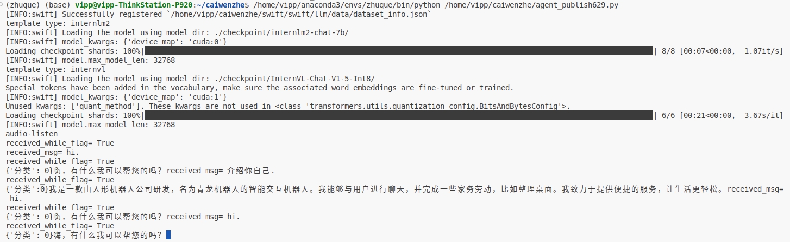

## 1. Hardware Connection（硬件设备）


## 2. Installation（环境）
```
#Test on Ubuntu 20.04 & CUDA 12.4（在Ubuntu20.04 & CUDA12.4测试）
（1）Client（客户端）：
conda create -n chat_qinglong python=3.10
conda activate chat_qinglong
pip install requests
pip install ws4py
pip install opencv-python
pip install pydub
pip install pyyaml
pip install opencv-python

                     
（2）Server（服务器端）：
conda create -n zhuque python=3.10
conda activate zhuque
# swift for internVL, for more infomation: https://swift.readthedocs.io/zh-cn/latest/Multi-Modal/internvl%E6%9C%80%E4%BD%B3%E5%AE%9E%E8%B7%B5.html
git clone GitHub - modelscope/swift: ms-swift: Use PEFT or Full-parameter to finetune 300+ LLMs or 50+ MLLMs. 
cd swift
pip install -e '.[llm]'
pip install Pillow
pip install thrift
pip install bitsandbytes
pip install timm
pip install flask
FLASH_ATTENTION_SKIP_CUDA_BUILD=TRUE pip install flash-attn --no-build-isolation
```

## 3. Parameters（参数说明）
```
# Required on both the client side and the server side.（在客户端和大模型端都需要填写）
server_ip='' #where large models loaded（运行大模型的设备IP）
front_end_ip='' #where you talk to（交互设备IP）
robo_ip='' #your control commands are sent to the robot at this IP（接受指令的机器人IP）
DEBUG='' #DEBUG mode is used to test the accuracy of large model skill invocation. In DEBUG mode, no instructions will be sent to the robot.（DEBUG模式用于测试大模型技能调用准确性，在DEBUG模式下不会向机器人下发指令）
```

## 4. Usage（使用）
```
#（1）Start agent_p.py on server.（在服务器，启动agent_p.py）
python agent_p.py

#（2）Start receive_image.py to receive images in real-time on server.（在服务器，启动receive_image.py，用于实时接收图像）
python receive_image.py

#（3）Start upload_image.py to send images in real-time.（在客户端，启动upload_image.py，用于实时发送图像）
python upload_image.py

#（4）在客户端，启动example_udp_text.py
python example_udp_text.py --input_type text
python example_udp_text.py --input_type speech
```
输入"退出"后,只有再次输入"你好",才会继续进行对话               
You will get similar output（你会得到类似输出）


Terminal displaying（终端出现以下信息表示web端口启动成功）                           


此时服务器端会实时接受POST请求，并返回200的HTTP状态码，表示图片接受成功。               
并且服务器的'upload/image.jpg'文件会实时刷新。             


在 https://aiui.xfyun.cn/ 新建Webapi应用,获得APPID和APPKEY,填入example_udp_text.py               
app_id = "YOUR_APP_IP"               
api_key = "YOUR_APP_KEY"               
网页中多处可以得到上述信息,下图为其中一个例子


You will get similar output（你会得到类似输出）


如果购买了讯飞多模态语音识别模块,
把讯飞多模态语音识别模块连接到Windows系统上,运行scrcpy.exe

页面打开后点击底部上滑，运行AIUIService_JniVer

点击"图像转换后预览"

页面的右下角,得到讯飞的IP

在main.py中填入讯飞的IP


语音输入"你好"后,终端出现类似输出代表成功使用语音进行交互


